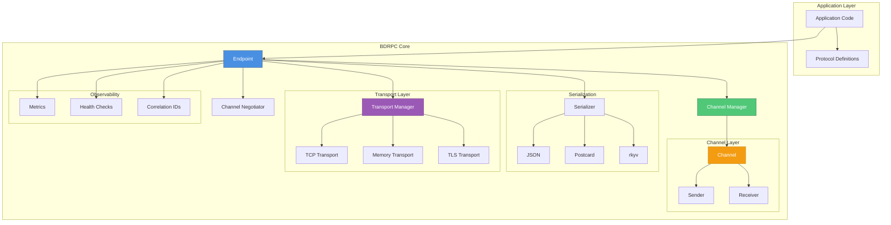
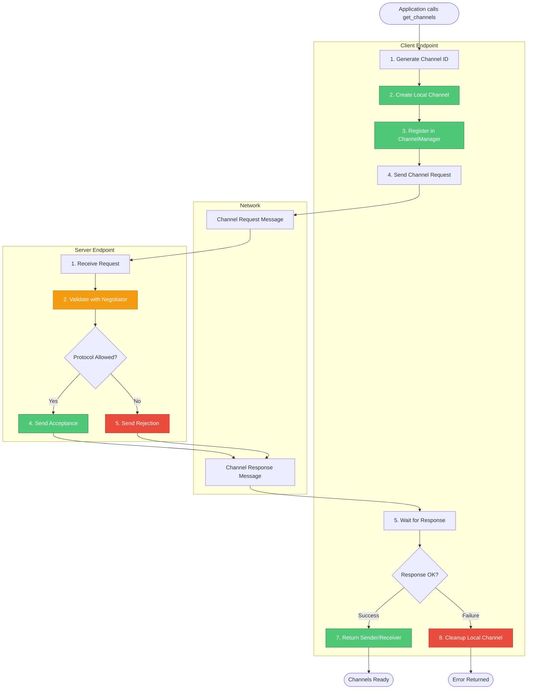
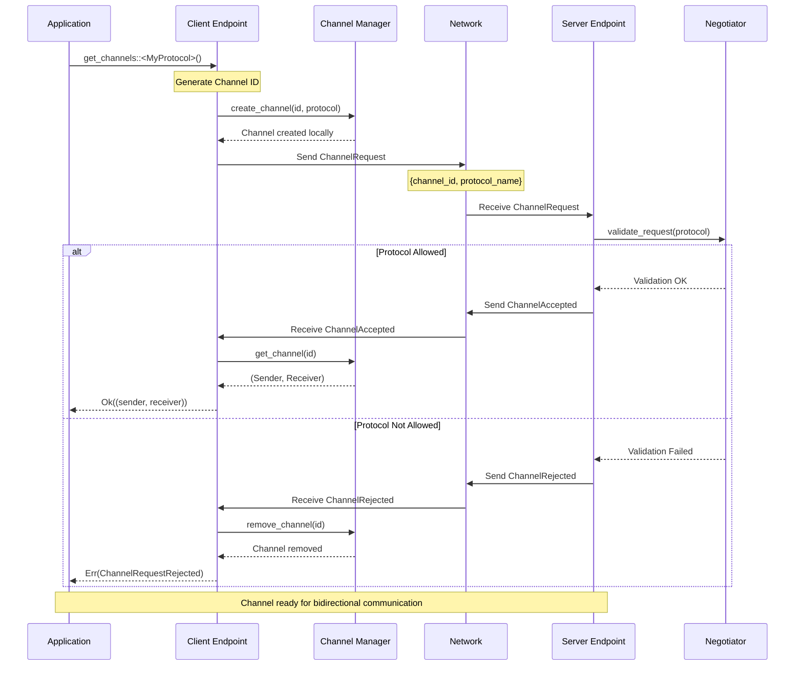
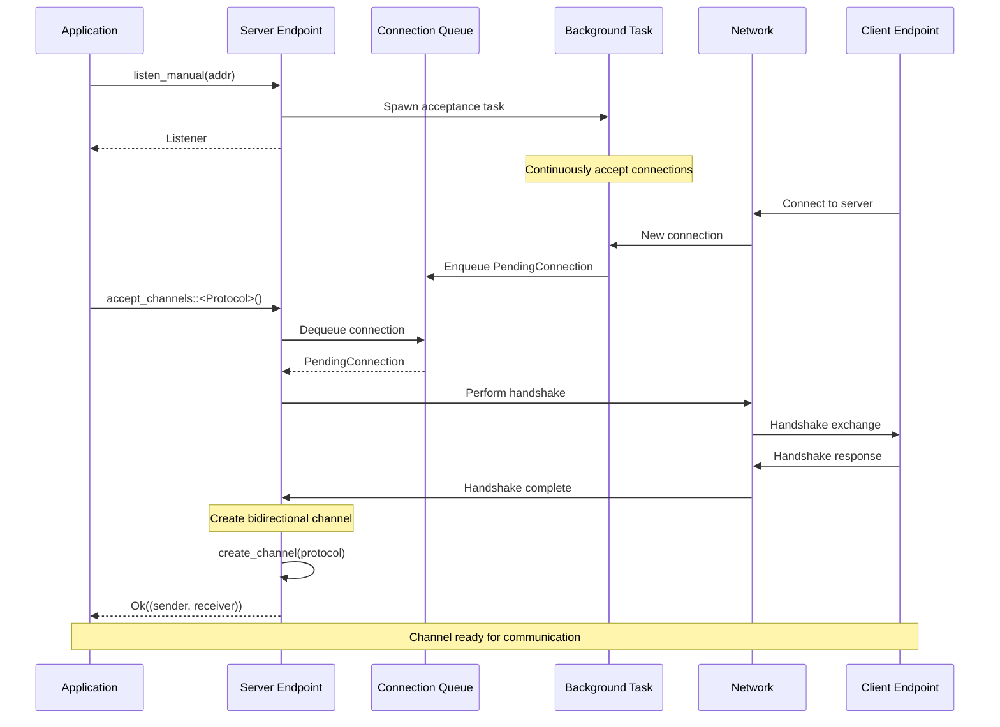
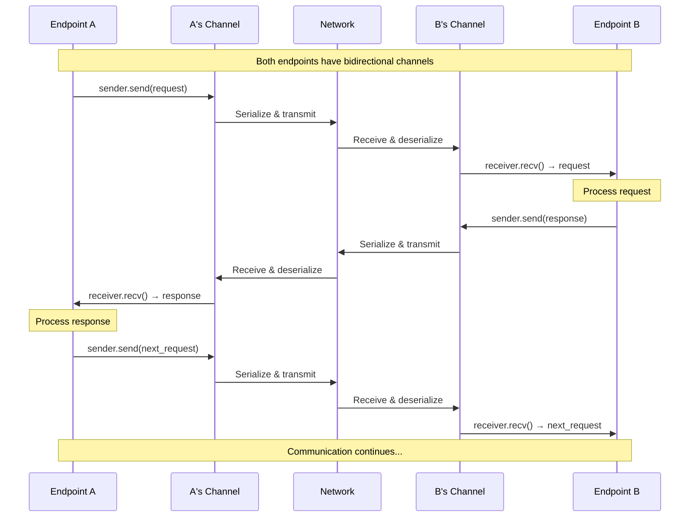
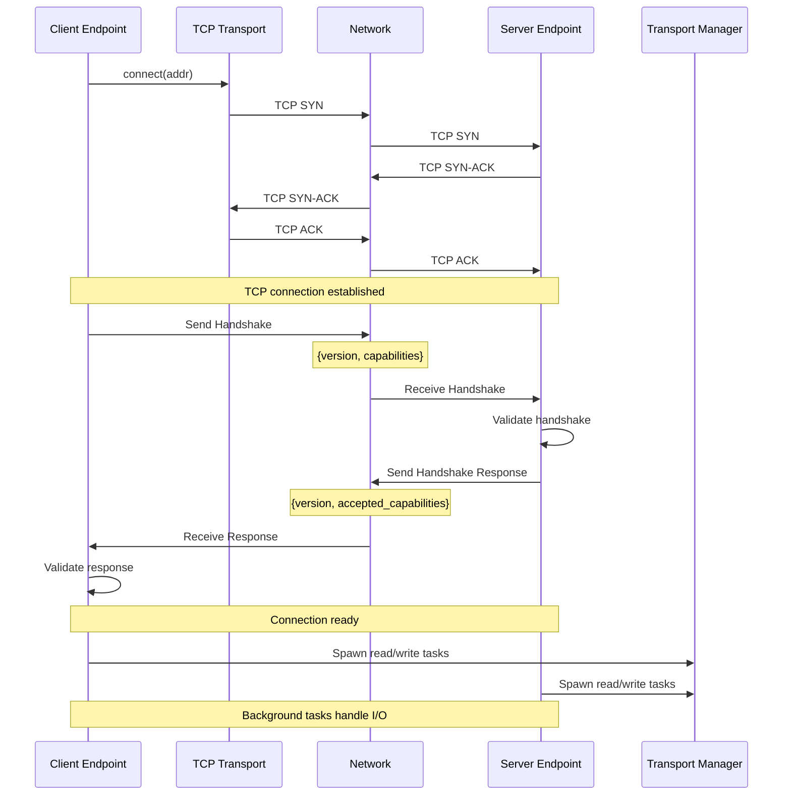
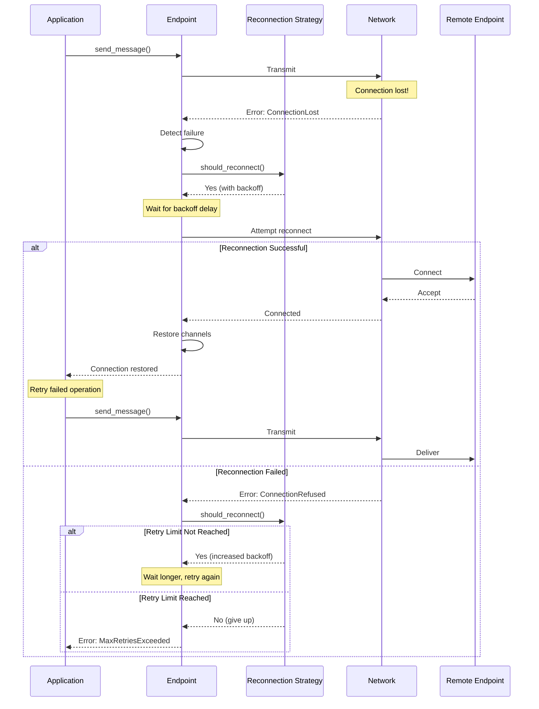
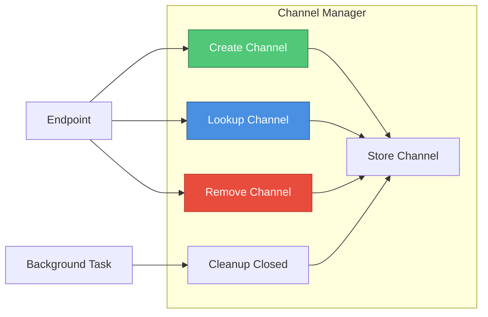
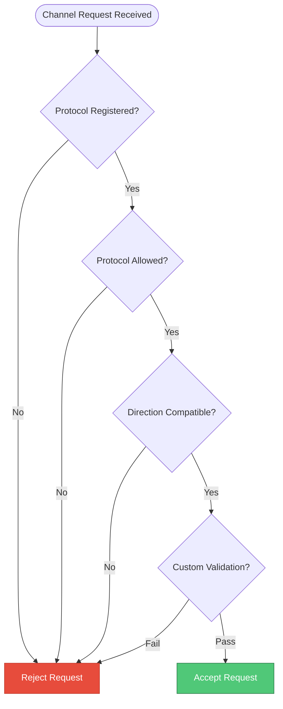
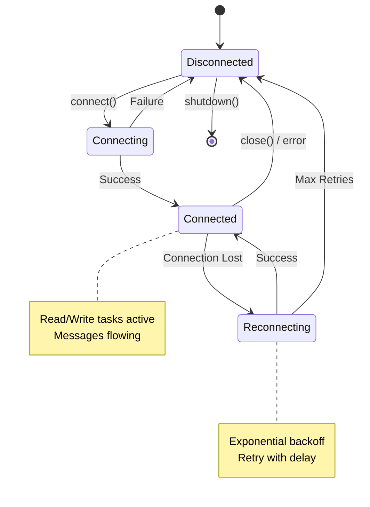

# BDRPC Architecture and Sequence Diagrams

This document contains visual diagrams showing the architecture and common patterns in BDRPC.

## Table of Contents

1. [Architecture Overview](#architecture-overview)
2. [Channel Creation Flow](#channel-creation-flow)
3. [Sequence Diagrams](#sequence-diagrams)
   - [get_channels() Pattern](#get_channels-pattern)
   - [accept_channels() Pattern](#accept_channels-pattern)
   - [Bidirectional Communication](#bidirectional-communication)
   - [Connection Establishment](#connection-establishment)
   - [Error Recovery](#error-recovery)

---

## Architecture Overview

This diagram shows the high-level architecture of BDRPC and how components interact.



---

## Channel Creation Flow

This diagram illustrates the complete flow of creating a bidirectional channel using `get_channels()`.



---

## Sequence Diagrams

### get_channels() Pattern

This sequence diagram shows the client-initiated channel creation pattern.



### accept_channels() Pattern

This sequence diagram shows the server-side manual acceptance pattern.



### Bidirectional Communication

This sequence diagram shows typical bidirectional message exchange.



### Connection Establishment

This sequence diagram shows the complete connection establishment flow.



### Error Recovery

This sequence diagram shows error detection and recovery flow.



---

## Component Interaction Details

### Channel Manager Responsibilities



### Negotiator Decision Flow



### Transport Layer State Machine



---

## Usage Examples

### Creating Channels (Client Side)

```rust
// Using get_channels() - recommended pattern
let (sender, receiver) = endpoint
    .get_channels::<MyProtocol>()
    .await?;

// Now you can send and receive
sender.send(request).await?;
let response = receiver.recv().await?;
```

### Accepting Channels (Server Side)

```rust
// Using accept_channels() - recommended pattern
let listener = endpoint.listen_manual("127.0.0.1:8080").await?;

loop {
    let (sender, receiver) = listener
        .accept_channels::<MyProtocol>()
        .await?;
    
    // Handle connection in separate task
    tokio::spawn(async move {
        handle_client(sender, receiver).await
    });
}
```

### Bidirectional Communication

```rust
// Both endpoints can send and receive simultaneously
tokio::select! {
    msg = receiver.recv() => {
        // Handle incoming message
        process_request(msg?).await?;
    }
    _ = sender.send(outgoing) => {
        // Message sent successfully
    }
}
```

---

## Best Practices

1. **Always use `get_channels()` for client-side channel creation** - it handles all the complexity
2. **Use `accept_channels()` for simple server patterns** - reduces boilerplate significantly
3. **Register protocols before creating channels** - automatic allowlisting works seamlessly
4. **Handle errors appropriately** - check for timeout, rejection, and connection failures
5. **Use bidirectional channels when both sides need to communicate** - more efficient than two unidirectional channels
6. **Implement proper cleanup** - channels are automatically cleaned up when dropped
7. **Monitor connection health** - use observability features for production deployments

---

## Related Documentation

- [Architecture Guide](architecture-guide.md) - Detailed architectural decisions
- [Best Practices](best-practices.md) - Comprehensive best practices guide
- [Quick Start](quick-start.md) - Getting started tutorial
- [Troubleshooting Guide](troubleshooting-guide.md) - Common issues and solutions
- [ADR-010: Dynamic Channel Negotiation](ADR/ADR-010-dynamic-channel-negotiation.md) - Channel negotiation design